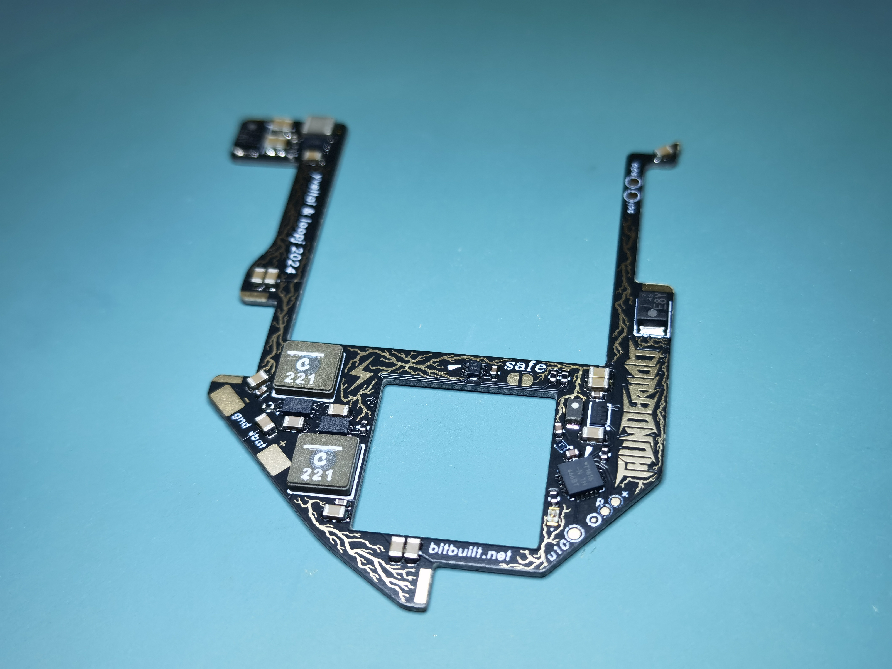
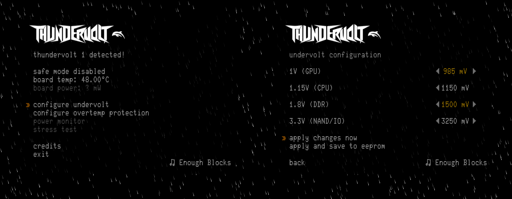

<picture> <source media="(prefers-color-scheme: dark)" srcset="images/thundervolt_logo_white.png">  </picture> 

Thundervolt is a suite of open-source hardware and software that enables software-configurable undervolting of 4-layer Wiis. 

The Thundervolt PCB (Thundervolt 1 and Thundervolt Lite shown) are stylish, highly-integrated power hats for 4-layer Wiis that solder directly to the Wii motherboard. Only 3 wires are necessary to connect Thundervolt to the Wii (I2C and Reset). Power is supplied via two additional wires.

The Thundervolt homebrew app (Dolphin debug version shown) provides granular control over each voltage regulator on the Thundervolt board, as well as emergency overtemperature protection with a configurable threshold. 

Users can apply changes live, and save settings to Thundervolt's EEPROM for persistence across reboots. 

More functionality such as CPU/GPU/MEM stress tests and a power monitor for Thundervolt 2 will be added to the app in the future.

## Features
- 0.8mm 4L rigid PCB — solders directly to 4-layer Wii motherboards
- 55 x 47mm — fits within all but the most extreme trim outlines
- 2.4V to 5.5V input (intended for 1S li-ion or 5V USB-C)
- Highly efficient I2C-controlled buck regulators for 1V, 1.15V, and 1.8V (η > 90%)
- Highly efficient I2C-controlled buck-boost regulator for 3.3V (η > 90%)
- Dynamic undervolting, configurable via Wii homebrew app
- Safe mode solder jumper to force stock voltages
- Wii power-on reset functionality (aka U10 emulation)
- Onboard TMP1075N for temperature monitoring and emergency overtemp shutdown
- Integrated INA700s for realtime voltage/current/power monitoring (Thundervolt 2 only)

## What Thundervolt does NOT do
- Battery management and charging
- Power button handling for portables
- USB PD negotiation

Adding a full BMS to Thundervolt would require major sacrifices to regulator efficiency, thermal performance, and cost. A companion board called *Mjolnir* is in development to fulfill these needs, and will feature tight integration with the existing Thundervolt ecosystem.

## Ordering & Assembly

See [the hardware folder](https://github.com/mackieks/thundervolt/tree/main/hardware) for details on ordering and assembling Thundervolt PCBs.

## Usage
The homebrew app is pretty self explanatory; see [the demo on YouTube](https://youtu.be/DeZFMLoE9EQ) for details. A full writeup will come later.

## Credits

Thundervolt hardware designed by YveltalGriffin

Thundervolt firmware by loopj

Thundervolt homebrew by:
- YveltalGriffin (UI, app)
- loopj (I2C, app)
- Alex/supertazon (graphics)
- ShockSlayer (music)

## License

Thundervolt hardware is licensed under Solderpad Hardware License v2.1.

Thundervolt software (firmware + homebrew) is provided under The MIT License.
