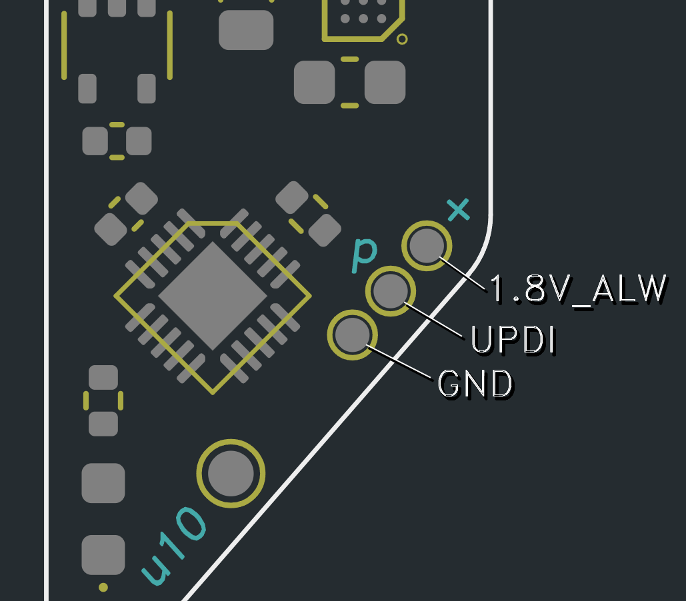

# Assembly

Before assembling a Thundervolt, you should have the following supplies:
- Thundervolt PCB
- Two jig PCBs (outer and inner)
- Electropolished solderpaste stencil
- Solder paste
  - Recommendations: [TS391AX](https://www.mouser.com/ProductDetail/Chip-Quik/TS391AX?qs=1mbolxNpo8ei%252BndH51pRbA%3D%3D) (leaded), [GC50](https://www.digikey.com/en/products/detail/loctite/2591111/12570372) (lead-free)
- Solder paste spreader
  - Recommendation: [SS-METAL-0.2-68X36](https://www.mouser.com/ProductDetail/Chip-Quik/SS-METAL-0.2-68X36?qs=By6Nw2ByBD2Amr8PPfSm%252Bg%3D%3D)
- [Fine tweezers](https://www.mouser.com/ProductDetail/Apex-Tool-Group/EROP3SA?qs=AGa1uUH1LDimyk4IzeBO0g%3D%3D) or a vacuum pen ([Pixel Pump](https://shop.robins-tools.com/products/pixel-pump-starter-kit), [Pick+](https://shop.randomhacks.pt/products/pick)) for component placement
- Reflow method
  - Hot plate: [UYUE 946-1010 or UYUE 946C  ](https://www.aliexpress.us/item/3256804722742113.html)
  - Reflow oven: [Controleo3](https://whizoo.com/collections/controleo3)
  - Hot air is **not** recommended for assembly as it will blow the chipscale BGAs away!
- Hot air station ([1](https://www.aliexpress.us/item/3256801112464148.html), [2](https://www.aliexpress.us/item/2255800796511424.html)), soldering iron ([1](https://pine64.com/product/pinecil-smart-mini-portable-soldering-iron/), [2](https://www.aliexpress.com/i/3256802537430044.html), [3](https://hakkousa.com/fx-951-soldering-station.html)) for rework
- Tacky flux for rework ([SMD291](https://www.mouser.com/ProductDetail/Chip-Quik/SMD291?qs=8BX3xQzFIvmwkympZqnNNA%3D%3D), [MG Chem 8341](https://www.mouser.com/ProductDetail/MG-Chemicals/8341-10ML?qs=SUQPjvP5usWRLDN27VlqNg%3D%3D), [AMTECH NC-559-V2](https://shop.inventec.dehon.com/products/copie-de-amtech-nc-559-v2), [CitriFlow](https://www.injuredgadgets.com/tcrs-citriflow-tm-no-clean-tacky-flux-paste-w-needle-and-cover-10g-syringe/))

Nice-to-haves:
- [Magnetic surface](https://www.ebay.com/itm/395527710592) to stencil on
- Nd magnets and double-sided tape for stenciling
- [Kimwipes](https://www.mouser.com/ProductDetail/MG-Chemicals/830-34155?qs=WXzVXFlun0Vx2RYSUZAAsA%3D%3D) and 91% isopropyl for cleanup
- Magnification is strongly recommended
  - [Magnifying Lamp](https://www.amazon.com/Brightech-LightView-PRO-Magnifying-Magnification/dp/B016LTTS8S/)
  - [Amscope 7x-45x](https://www.ebay.com/itm/140938262240)
- [Ultrasonic cleaner](https://www.amazon.com/VEVOR-Commercial-Ultrasonic-Capacity-Solution/dp/B01HGNM5WE)

## Stenciling

Once you have everything you need, you can begin stenciling. Apply some double-sided tape to the back of the outer jig PCB.

Adhere the jig to your stenciling surface.

Prep the Thundervolt PCB by cleaning it with isopropyl alcohol. Then insert the Thundervolt PCB and inner jig into the outer jig.

Prep the stencil by cleaning it with isopropyl alcohol.

Align the stencil with the Thundervolt PCB. Make sure the stencil apertures align perfectly with the exposed pads on the board— good lighting is critical here. Use some tape at the top edge of the stencil to secure it in place and act as a hinge. If you are using a magnetic stenciling surface, you can place some strong magnets on the edges of the stencil to keep it flush.

Dispense some solderpaste in a line across the top edge of the stencil and squeegee it downward. There are many tutorials for stenciling on YouTube if you need additional guidance.

Carefully slide the magnets off the stencil and peel it up. The cleaner your pasting and stencil release, the less rework you will have to perform after reflow. It's worth retrying the process a couple times to get it right.

Open the BOM.html file for your Thundervolt variant in a web browser and place all the components with tweezers or a vacuum pen.

Reflow the PCBA. A hot plate works well for one-offs. Otherwise, use a reflow oven. Hot air is **not** recommended for reflow as it tends to blow the chipscale BGAs away.

## Rework

You may need to perform rework on your Thundervolt board, especially if you ordered a HASL board, or your pasting job was messy (both of which were true for this example assembly!) Inspect the board for any misaligned or tombstoned components, and any head-in-pillow defects. Any free-floating solder balls should also be removed.

Drowning components in tacky flux and reflowing them with hot air solves most issues. Sometimes you need to remove a component, re-tin the pads on the PCB with your iron, and reflow the part back on. 

After rework, clean off all flux residue with Kimwipes and 91% isopropyl or an ultrasonic cleaner. Inspect all the solder joints, especially on the voltage regulators and BGAs. 

Check for shorts between GND and the following nets: VBAT, 1.8V_ALW, LX1/LX2 on the 3.3v regulator, and the output rails. Also check for shorts between EN (non-GND side of R7) and VBAT/LX1/LX2/3.3V. (LX1 and LX2 are the two pins of L4.)

## Bring-Up

Once the board is fully assembled and cleaned, you can flash it. Congrats!

Thundervolt must be powered from the VBAT and GND pads in order to be flashed! Connect a 2.5V - 5.5V supply (or 1S li-ion battery) to VBAT and GND. Measure voltage between 1.8V_ALW and GND at the programming pads to confirm the LDO is outputting 1.8V.

Now you can connect your programmer to the programming pads and flash the latest Thundervolt firmware. Be sure to build and flash the firmware matching your board type.

All board variants have the same programming pad layout. Reference your programmer's docs for its pinout.

See the [software folder](https://github.com/mackieks/thundervolt/tree/main/software) for more details on building and flashing the firmware.

