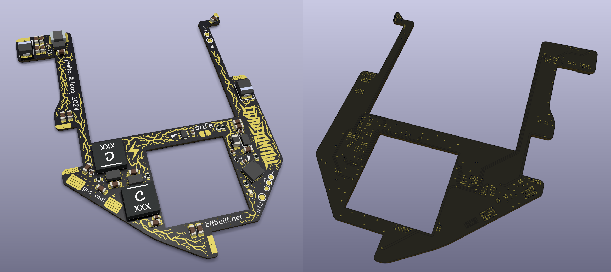

<picture> <source media="(prefers-color-scheme: dark)" srcset="../images/thundervolt_logo_white.png">  </picture> 

There are 3 variants of the Thundervolt PCB. As of 2024-07-07, **Thundervolt Lite** and **Thundervolt 1** have been released.
- **Thundervolt Lite**
  - A low cost revision of the original design with **identical functionality** to Thundervolt 1. It does not require VIPPO and only costs $7 for 10 bare boards!
  - Thundervolt Lite is easier to assemble and easier to solder to the Wii motherboard.
  - Fully tested and released to the public! This folder contains the KiCAD source and Gerbers.
- **Thundervolt 1**
  - The original design, with software-controlled undervolting and temperature sensing. It requires a [VIPPO/POFV PCB](https://jlcpcb.com/blog/32-Free-Via-in-Pad-on-6-20-Layer-PCBs-with-POFV) which is rather expensive ($10 per bare board).
  - Fully tested and released to the public! This folder contains the KiCAD source and Gerbers.
- **Thundervolt 2**
  - The Lamborghini of Wii voltage regulation. Thundervolt 2 includes four INA700 power monitor ICs and can report the Wii's current and power consumption in real time. It requires an even higher spec PCB than Thundervolt 1 and is quite expensive ($14-$20 per bare board)
  - Currently unreleased — still in testing

- All Thundervolt revisions require placing and reflowing at least one chipscale BGA (the TPS63810 3.3V buck-boost regulator). 
- Thundervolt 1 and 2 require placing and reflowing an additional chipscale part (LP5907UVX-1.8, 0.7x0.7mm) and have tighter component spacing than Lite. 
- Thundervolt 2 also requires placing four additional chipscale BGAs (INA700, 1.2x1.3mm)
- Thundervolt Lite is the easiest to assemble. Thundervolt 1 is tougher, and Thundervolt 2 is the most challenging. Magnification is highly recommended for assembling all variants.

Two jig PCBs for solderpaste stenciling are also provided. Order both jigs as 2-layer 0.8mm boards.



## Ordering PCBs

### Thundervolt Lite

Recommended board fabrication specs for **Thundervolt Lite** (JLCPCB).

**MANDATORY**
- 0.8mm 4-layer rigid PCB
- Tented or plugged vias
- Min via hole size/diameter: leave at default. Thundervolt Lite has large vias that do not incur additional charges.

Optional
- ENIG (improves solderability for chipscale BGAs)
- 1oz/in² copper on internal layers - not necessary, but technically improves PDN performance (imperceptible to end user)
- Black soldermask - not necessary, but looks great with the lightning bolt art :)

In the **Remark** section of your Thundervolt Lite PCB order, paste the following comment:
```
Kindly note that the graphics on the fMask layer are for aesthetics. Please do NOT edit any of the fMask apertures on the board, or remove any thin soldermask webs. Thank you!
```

If JLC tries to upcharge you for the soldermask artwork, push back. The artwork requires zero additional work or intervention on their part. Feel free to reference my Thundervolt Lite order number if necessary: **Y118-2549677A**

### Thundervolt 1

Recommended board fabrication specs for **Thundervolt 1** (JLCPCB). Thundervolt 1 is a high-spec PCB. Please read this entire section so you understand the fab requirements. 

**MANDATORY**
- 0.8mm 4-layer rigid PCB
- Epoxy Filled & Capped vias (aka VIPPO or POFV)
- Min via hole size/diameter: 0.15mm/(0.25/0.3mm)

Optional
- ENIG (improves solderability for chipscale BGAs)
- 1oz/in² copper on internal layers - not necessary, but technically improves PDN performance (imperceptible to end user)
- Black soldermask - not necessary, but looks great with the lightning bolt art :)

In the **Remark** section of your Thundervolt 1 PCB order, paste the following comment:
```
Kindly note that the graphics on the fMask layer are for aesthetics. Please do NOT edit any of the fMask apertures on the board, or remove any thin soldermask webs. Thank you!
```

If JLC tries to upcharge you for the soldermask artwork, push back. The artwork requires zero additional work or intervention on their part. Feel free to reference my Thundervolt 1 order number if necessary: **Y108-2549677A**

**Note:** Check the box for **Confirm Production File**. Then check the box for "Do Not Confirm Automatically." JLCPCB will often edit the gerbers in unpleasant ways and you **must** push back on this. If they change the via drill sizes, you need to request that they abide by their listed spec of 0.15mm drills. 

A comment like this when reviewing the production file goes a long way:
```
In the production file, the via drill size has been changed from 0.15mm to 0.2mm [or whatever they changed it to]. Please do not change the via size. They should be 0.15mm drill and 0.3mm diameter as in the original file. I greatly appreciate your assistance with this. Thanks!
```

Some amount of "compensation" (growth of annular rings + padshaving) is unavoidable; however, if the drills are increased to 0.2mm or more, this will result in extreme padshaving of many vias/traces. You'll also notice that they expand the copper clearance around drills on inner layers as part of the compensation process. As long as they are not changing the drill diameters, this is OK. They may also request to remove annular rings ("pads") on internal layers. This is OK as it lessens the impact of their copper clearance expansion on the inner planes.


## Stencil and Jig

Both an electropolished solder paste stencil and the two jig PCBs (jig1, jig2) are **highly** recommended for assembly. 

**MANDATORY STENCIL SPECS**
- Custom dimensions: **90 x 90mm**
- Top only
- Electropolishing

Order both jig1 and jig2 as 0.8mm 2-layer PCBs. In the **Remark** section of both jig PCB orders, paste the following comment:
```
Please note that this is a mechanical PCB and does not contain any drill holes or soldermask openings. Thank you!
```

## BOM

**Thundervolt Lite:** [Link to Mouser cart with BOM](https://www.mouser.com/ProjectManager/ProjectDetail.aspx?AccessID=3CC491924A) [Link to Digikey cart with BOM](https://www.digikey.com/en/mylists/list/P9BJON8540)

**Thundervolt 1**: [Link to Mouser cart with BOM](https://www.mouser.com/ProjectManager/ProjectDetail.aspx?AccessID=D2F0182832)

**Note:** The 0412CDMCCDS-R22MC low-profile inductors used on Thundervolt Lite are only available [from Digikey.](https://www.digikey.com/en/products/detail/sumida-america-inc/0412CDMCCDS-R22MC/11682034)

**Note:** The XFL5015-221MEC low-profile inductors used on Thundervolt 1 and Thundervolt 2 are only available [directly from Coilcraft.](https://www.coilcraft.com/en-us/products/power/shielded-inductors/molded-inductor/xfl/xfl501x/xfl5015-221/)

## Assembly

See [ASSEMBLY.md](https://github.com/mackieks/thundervolt/blob/main/hardware/ASSEMBLY.md) for assembly instructions.

## License

Thundervolt hardware was designed by YveltalGriffin and is licensed under Solderpad Hardware License v2.1.
