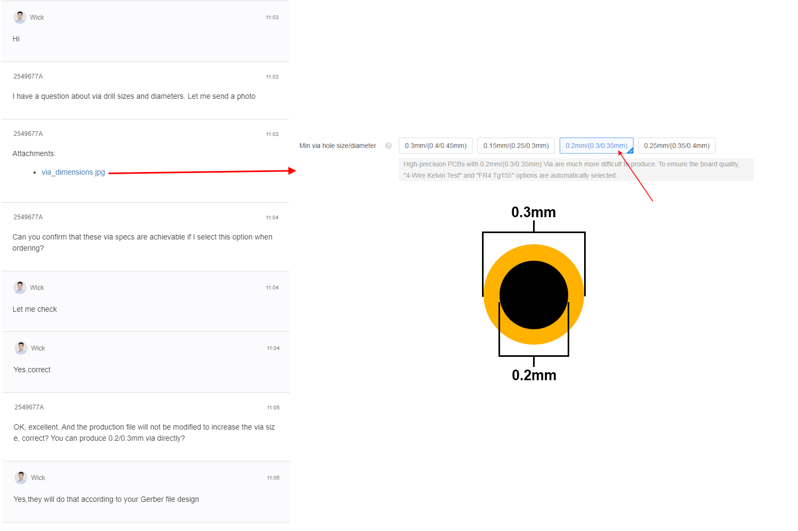

<picture> <source media="(prefers-color-scheme: dark)" srcset="../images/thundervolt_logo_white.png">  </picture> 

There are 3 variants of the Thundervolt PCB. As of 2024-07-01, only **Thundervolt 1** has been released.
- **Thundervolt 1**
  - The original design, with software-controlled undervolting and temperature sensing. It requires a [VIPPO/POFV PCB](https://jlcpcb.com/blog/32-Free-Via-in-Pad-on-6-20-Layer-PCBs-with-POFV) which is rather expensive ($10 per bare board).
  - Fully tested and released to the public! This folder contains the KiCAD source and Gerbers.
- **Thundervolt Lite**
  - A low cost revision of the original design with **identical functionality** to Thundervolt 1. It does not require VIPPO and only costs $7 for 10 bare boards!
  - Currently unreleased — still in testing
- **Thundervolt 2**
  - The Lamborghini of Wii voltage regulation. Thundervolt 2 includes four INA700 power monitor ICs and can report the Wii's current and power consumption in real time. It requires an even higher spec PCB than Thundervolt 1 and is quite expensive ($14-$20 per bare board)
  - Currently unreleased — still in testing

Two jig PCBs for solderpaste stenciling are also provided. Order both jigs as 2-layer 0.8mm boards.


## Ordering & Assembly
Recommended board fabrication specs for **Thundervolt 1** (JLCPCB). Thundervolt is a high-spec PCB. Please read this entire section so you understand the fab requirements. 

**MANDATORY**
- 0.8mm 4-layer rigid PCB
- Epoxy Filled & Capped vias (aka VIPPO or POFV)
- Min via hole size/diameter: 0.2mm/(0.3/0.35mm)
- ENIG (improves solderability for chipscale BGAs)

Optional
- Black soldermask - not necessary, but looks great with the lightning bolt art :)
- 1oz/in² copper on internal layers - not necessary, but technically improves PDN performance

In the **Remark** section of your Thundervolt 1 PCB order, paste the following comment:
```
Kindly note that the graphics on the fMask layer are artwork for aesthetic purposes. Please do NOT edit any of the fMask apertures on the board, or remove any thin soldermask webs. Thank you!
```

**Note:** Check the box for **Confirm Production File**. Then check the box for "Do Not Confirm Automatically." JLCPCB will often edit the gerbers in unpleasant ways and you **must** push back on this. If they change the via drill size or via diameter, you need to request that they abide by their listed spec of 0.2mm drill and 0.3mm via diameter without editing the design files. 

If JLCPCB complains further about the via hole sizes, patiently explain that both their order form and customer service explicity state that vias with 0.2mm drills and 0.3mm diameter are supported. This image may come in handy:



A comment like this when reviewing the production file goes a long way:
```
In the production file, the via diameter has been changed from 0.3mm to 0.35mm [or whatever they changed it to]. Please do not change the via size. They should be 0.2mm drill and 0.3mm diameter as in the original file. I greatly appreciate your assistance with this. Thanks!
```

You'll notice that they grow the copper clearance around drills on inner layers. As long as they are not changing the via diameters, this is OK. They may also request to remove annular rings ("pads") on internal layers. This is good as it lessens the impact of their copper clearance expansion on the inner planes.


Both an electropolished solder paste stencil and the two jig PCBs (jig1, jig2) are **highly** recommended for assembly. 

**Note:** When ordering the stencil, you must specify custom dimensions of **90 x 90mm**. Select electropolishing to avoid issues when pasting the chipscale BGAs.

Order both jig1 and jig2 as 0.8mm 2-layer PCBs. In the **Remark** section of both jig PCB orders, paste the following comment:
```
Please note that this is a mechanical PCB and does not contain any drill holes or soldermask openings. Thank you!
```

Cost of 10 Thundervolt 1 boards with all recommended parameters, plus an electropolished stencil, is 120USD. (Jig PCBs and shipping are extra)

[Link to Mouser cart with BOM](https://www.mouser.com/ProjectManager/ProjectDetail.aspx?AccessID=D2F0182832)

**Note:** The XFL5015-221MEC low-profile inductors used on Thundervolt 1 and Thundervolt 2 are only available [directly from Coilcraft.](https://www.coilcraft.com/en-us/products/power/shielded-inductors/molded-inductor/xfl/xfl501x/xfl5015-221/)

## License

Thundervolt hardware was designed by YveltalGriffin and is licensed under Solderpad Hardware License v2.1.
