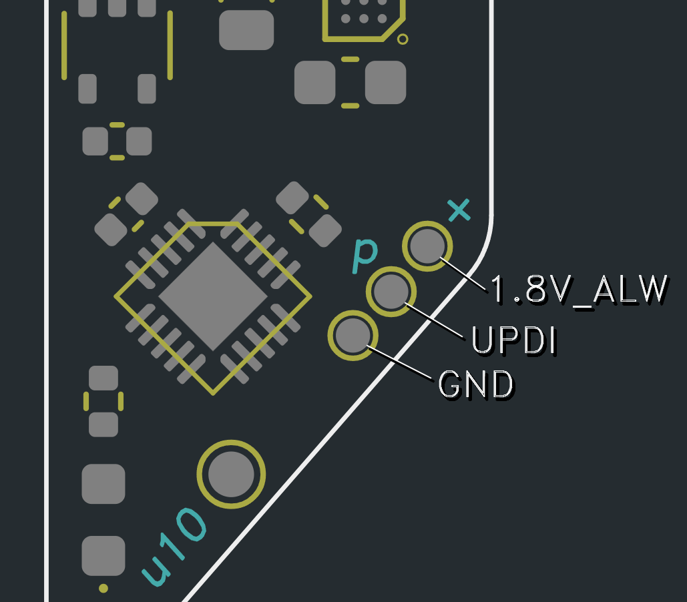

# Thundervolt Software

Firmware and homebrew for Thundervolt.

Pre-built binaries for the firmware, and packages for the homebrew can be found in the [releases](https://github.com/mackieks/thundervolt/releases) section.

## Firmware

The Thundervolt firmware is written in AVR C with no external dependencies. We use [PlatformIO](https://platformio.org/) to build and flash the firmware, providing a consistent build environment and an easy way to manage toolchains.

### Prerequisites

- [PlatformIO Core](https://platformio.org/install) installed.
- UPDI programmer (e.g., [ATMEL-ICE](https://www.microchip.com/en-us/development-tool/atatmel-ice), [Adafruit UPDI Friend](https://www.adafruit.com/product/5879), [SerialUPDI](https://www.tindie.com/products/mcudude/serialupdi-programmer/)).

### Building

To build the firmware using PlatformIO, enter the `firmware` directory and run:

```bash
pio run -e thundervolt-hw1
```

This will automatically download the required toolchain and build the firmware.

If you are using VS Code, you can build the firmware by opening the firmware folder in VS Code, selecting your target, and clicking the Build button at the bottom of the window.

### Flashing

Flashing the firmware required a UPDI programmer. You can use the official [ATMEL-ICE](https://www.microchip.com/en-us/development-tool/atatmel-ice), or a cheaper programmer such as the [Adafruit UPDI Friend](https://www.adafruit.com/product/5879) or MCUdude's [SerialUPDI](https://www.tindie.com/products/mcudude/serialupdi-programmer/).

To flash the firmware using PlatformIO, run:

```bash
pio run -e thundervolt-hw1 -t upload
```

You can also click the Upload button if you're using VS Code.

Ensure your UPDI programmer is connected before running the command! All Thundervolt board variants have the same programming pad pinout, but you'll need to reference your specific programmer's docs for its pinout. 



The Thundervolt board must be powered from a 2.5V - 5.5V supply for programming to succeed! See [ASSEMBLY.md](https://github.com/mackieks/thundervolt/blob/main/hardware/ASSEMBLY.md) for details.

## Homebrew

The Thundervolt homebrew is a standard Wii homebrew, built with [devkitPro](https://devkitpro.org/). It depends on [GRRLIB](https://github.com/GRRLIB/GRRLIB).

### Prerequisites

- [devkitPro](https://devkitpro.org/wiki/Getting_Started) installed.
- [GRRLIB](https://github.com/GRRLIB/GRRLIB) installed.

### Building

To build the homebrew, enter the `homebrew` directory and run:

```bash
make
```

This will create a `thundervolt.dol` file.

### Packaging

To build a zip package of homebrew and assets, run:

```bash
make dist
```

The zip package will be created in the `dist` directory.
